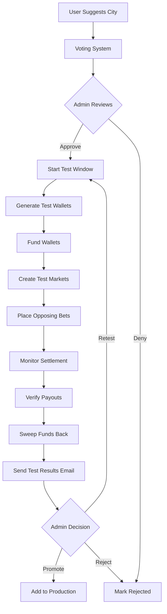
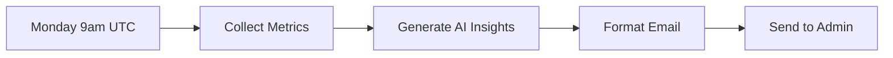

# Epic 8 Implementation Guide: AI-Powered City Approval Workflow

**Date**: December 2024
**Version**: 1.0
**Status**: Complete and Deployed

---

## Table of Contents

1. [Overview](#overview)
2. [Architecture](#architecture)
3. [Components](#components)
4. [Test Window Flow](#test-window-flow)
5. [Magic Links Security Model](#magic-links-security-model)
6. [AI Insights Integration](#ai-insights-integration)
7. [Weekly Reports System](#weekly-reports-system)
8. [Database Schema](#database-schema)
9. [API Endpoints](#api-endpoints)
10. [Security Considerations](#security-considerations)
11. [Troubleshooting](#troubleshooting)

---

## Overview

Epic 8 introduces an **AI-powered city approval workflow** that enables admins to test, validate, and approve user-suggested cities before adding them to the production market rotation.

### Core Features

1. **Admin Panel**: Tabbed interface for managing city suggestions
2. **Automated Testing**: 4-hour test window with real markets and real bets
3. **Email Notifications**: Detailed test results sent to admin
4. **Magic Links**: One-click approve/deny actions from email
5. **Weekly Reports**: AI-generated insights on platform performance
6. **Fund Safety**: Automatic fund recovery with secure wallet management

### Key Objectives

- **Quality Control**: Test cities before public launch
- **Automation**: Reduce manual testing burden
- **Transparency**: Detailed test results with payout verification
- **Insights**: Data-driven recommendations for city approvals

---

## Architecture

### High-Level Flow



### System Components

| Component | Purpose | Location |
|-----------|---------|----------|
| Admin Panel | Review and manage suggestions | `/apps/web/src/app/admin/suggestions` |
| Test Runner | Orchestrate test window flow | `/apps/web/src/lib/test-runner.ts` |
| Test Wallets | Manage ephemeral test wallets | `/apps/web/src/lib/test-wallets.ts` |
| Test Markets | Create and manage test markets | `/apps/web/src/lib/test-markets.ts` |
| Magic Links | Generate secure action tokens | `/apps/web/src/lib/magic-links.ts` |
| AI Insights | Generate weekly summaries | `/apps/web/src/lib/ai-insights.ts` |
| Email Service | Send test results and reports | `/apps/web/src/lib/email.ts` |
| Weekly Cron | Automated weekly reports | `/apps/web/src/app/api/cron/weekly-report` |

---

## Components

### 1. Admin Panel (`/admin/suggestions`)

**Tabbed Interface** for managing city suggestions:

#### Tab 1: Pending
- Shows all `PENDING` suggestions
- Displays vote counts and trending indicators
- Quick approve/deny actions
- Sort by total votes or recent votes

#### Tab 2: Testing
- Shows suggestions with active `TestRun`
- Displays test progress (markets created/settled)
- Estimated completion time
- Cannot promote until all markets settled

#### Tab 3: Live
- Shows approved cities in production rotation
- Displays city performance metrics
- Option to pause/remove from rotation (future)

#### Tab 4: Rejected
- Archive of denied suggestions
- Shows rejection date and reason
- Option to reconsider (future)

### 2. Test Runner Module

**Core orchestration module** that manages the complete test window lifecycle.

**Location**: `/apps/web/src/lib/test-runner.ts`

**Key Functions**:

```typescript
// Start a test window for a suggestion
async function startTestWindow(suggestionId: string): Promise<TestRun>

// Monitor test run for settlement
async function monitorTestRun(testRunId: string): Promise<void>

// Finalize test run and send results
async function finalizeTestRun(testRunId: string): Promise<TestResults>
```

**Workflow**:
1. Generate 2 ephemeral test wallets
2. Encrypt private keys (AES-256)
3. Fund wallets from admin wallet
4. Create 5 test markets with staggered times
5. Place opposing bets
6. Monitor for settlement
7. Verify payouts
8. Sweep funds back
9. Send results email

**Safety Features**:
- Keys encrypted at rest
- Funds never lost (recovery system)
- Full audit trail
- Error handling at each step

### 3. Test Wallets Module

**Manages ephemeral wallet lifecycle** for test runs.

**Location**: `/apps/web/src/lib/test-wallets.ts`

**Key Functions**:

```typescript
// Generate fresh test wallets
function generateTestWallets(count: number): TestWallet[]

// Encrypt wallet keys for storage
function encryptWalletKeys(wallets: TestWallet[]): string

// Decrypt keys for fund recovery
function decryptWalletKeys(encrypted: string): TestWallet[]

// Fund wallets from admin wallet
async function fundWallets(
  wallets: TestWallet[],
  amountPerWallet: string,
  publicClient: PublicClient,
  adminWalletClient: WalletClient
): Promise<FundingResult>

// Sweep funds back to admin
async function sweepWallets(
  wallets: TestWallet[],
  toAddress: string,
  publicClient: PublicClient,
  rpcUrl: string
): Promise<SweepResult>
```

**Security Considerations**:
- Private keys generated with `crypto.randomBytes(32)`
- Keys encrypted using AES-256-GCM
- Keys only decrypted when sweeping funds
- Keys disposed only after confirmed fund recovery
- Minimum 3 block confirmations required

### 4. Test Markets Module

**Creates and manages test markets** on production contract.

**Location**: `/apps/web/src/lib/test-markets.ts`

**Key Functions**:

```typescript
// Create test markets with staggered times
async function createTestMarkets(params: {
  testRunId: string;
  wallets: TestWallet[];
  cityId: string;
  baseResolveTime: number;
}): Promise<CreateMarketsResult>

// Place opposing bets on all markets
async function placeBets(
  markets: CreatedMarket[],
  wallets: TestWallet[]
): Promise<PlaceBetsResult>

// Verify payouts after settlement
async function verifyPayouts(
  markets: CreatedMarket[],
  wallets: TestWallet[],
  betResults: BetResult[]
): Promise<VerifyPayoutsResult>
```

**Test Market Characteristics**:
- `isTest: true` flag (hidden from public)
- Uses production contract (real settlement)
- Staggered resolve times (30min, 1hr, 2hr, 3hr, 4hr)
- Unequal bet amounts to verify payout math
- Linked to `TestRun` via `testRunId`

### 5. Magic Links Module

**Generates secure, time-limited action tokens** for email workflows.

**Location**: `/apps/web/src/lib/magic-links.ts`

**Key Functions**:

```typescript
// Generate magic link with token
async function generateMagicLink(params: {
  suggestionId: string;
  action: 'approve' | 'deny';
  expiryHours?: number;
}): Promise<string>

// Create magic link URLs for email
async function createMagicLinkUrls(
  suggestionId: string,
  baseUrl?: string
): Promise<{ approveUrl: string; denyUrl: string }>

// Validate and use a magic link
async function validateAndUseMagicLink(
  token: string,
  userWallet?: string
): Promise<ValidateMagicLinkResult>
```

**Security Features**:
- 256-bit random tokens (crypto.randomBytes)
- SHA256 hashing (tokens never stored plain)
- Constant-time comparison (timing attack protection)
- 48-hour expiry by default
- One-time use enforcement
- Audit trail (who used, when)

---

## Test Window Flow

### Step-by-Step Process

#### 1. Approval Trigger

**Admin clicks "Approve" in panel or email**

```typescript
POST /api/admin/suggestions/approve
{
  "suggestionId": "clx123abc"
}
```

#### 2. Wallet Generation

**Generate 2 fresh wallets**

```typescript
const wallets = generateTestWallets(2);
// Wallet A (YES bettor): 0x742d35...
// Wallet B (NO bettor): 0x8a1f23...
```

**Encrypt keys**

```typescript
const encryptedKeys = encryptWalletKeys(wallets);
// Stored in TestRun.walletKeys
```

#### 3. Funding

**Transfer FLR from admin wallet**

```typescript
const fundingResult = await fundWallets(
  wallets,
  '12.5', // FLR per wallet
  publicClient,
  adminWalletClient
);
// Total funding: 25 FLR
```

#### 4. Market Creation

**Create 5 test markets with staggered times**

```typescript
const marketsResult = await createTestMarkets({
  testRunId,
  wallets,
  cityId: 'nyc',
  baseResolveTime: Date.now() / 1000 + 1800, // +30 min
});

// Markets created at:
// - Market 1: +30 min
// - Market 2: +1 hour
// - Market 3: +2 hours
// - Market 4: +3 hours
// - Market 5: +4 hours
```

**Database Records**

```typescript
// Each market has:
{
  isTest: true,           // Hidden from public
  testRunId: "xyz123",    // Links to TestRun
  contractMarketId: 123,  // On-chain ID
  cityName: "New York",
  thresholdTemp: 723,     // 72.3°F in tenths
  resolveTime: timestamp
}
```

#### 5. Bet Placement

**Place opposing bets with unequal amounts**

```typescript
const betsResult = await placeBets(markets, wallets);

// Example distribution:
// Market 1: YES 2.0 FLR  | NO 3.0 FLR
// Market 2: YES 2.5 FLR  | NO 2.5 FLR
// Market 3: YES 3.0 FLR  | NO 2.0 FLR
// Market 4: YES 1.5 FLR  | NO 3.5 FLR
// Market 5: YES 2.0 FLR  | NO 3.0 FLR
```

**Why unequal amounts?**
- Verifies payout calculation logic
- Tests edge cases (small bets, large bets)
- Mimics real user behavior

#### 6. Settlement Monitoring

**Check markets every 5 minutes**

```typescript
// Existing settler cron handles resolution
// GET /api/cron/settle-markets (every 5 min)

// Test runner monitors:
setTimeout(() => {
  monitorTestRun(testRunId);
}, 5 * 60 * 1000);

// Checks on-chain market status:
// - ACTIVE (0): Betting open
// - CLOSED (1): Betting closed, waiting for resolution
// - RESOLVED (2): Settled with outcome
```

#### 7. Payout Verification

**After all markets settled**

```typescript
const payoutResult = await verifyPayouts(markets, wallets, betResults);

// For each market:
// 1. Query on-chain outcome (YES/NO)
// 2. Calculate expected payout:
//    payout = (winningBet / winningPool) * losingPool * (1 - fee)
// 3. Check actual wallet balances
// 4. Compare expected vs actual (±0.001 FLR tolerance)
// 5. Flag discrepancies as FAILED
```

#### 8. Fund Recovery

**Sweep funds back to admin wallet**

```typescript
const sweepResult = await sweepWallets(
  wallets,
  adminWalletAddress,
  publicClient,
  rpcUrl
);

// Process:
// 1. Decrypt wallet keys
// 2. Query each wallet balance
// 3. Transfer all FLR to admin wallet
// 4. Wait for 3 block confirmations
// 5. Verify admin wallet balance increased

// Only after confirmed:
await prisma.testRun.update({
  where: { id: testRunId },
  data: { keysDisposed: true }
});
```

**Safety Rules**:
- NEVER dispose keys before confirmed sweep
- Log all transaction hashes
- Store fund amounts in database
- Alert on sweep failures

#### 9. Email Results

**Send detailed test report**

```typescript
const emailData = {
  cityName: 'New York',
  testRunId,
  startedAt: '2024-12-15T10:23:00Z',
  completedAt: '2024-12-15T14:41:00Z',
  marketsCreated: 5,
  marketsSettled: 5,
  temperatureData: [
    { time, threshold, actual, outcome },
    // ... for each market
  ],
  totalVolume: '25.0',
  totalPayouts: '24.87',
  netGasCost: '0.13',
  payoutVerified: true,
  approveUrl: magicLinks.approveUrl,
  denyUrl: magicLinks.denyUrl,
};

await sendTestResultsEmail(emailData);
```

---

## Magic Links Security Model

### Token Generation

**256-bit random tokens** for cryptographic security:

```typescript
function generateToken(): string {
  return randomBytes(32).toString('hex');
  // Example: "a3f5c8e9d2b1f4a7c6e8d9f2b4a1c7e5..."
}
```

### Token Storage

**Never store tokens in plain text**:

```typescript
const token = generateToken();
const tokenHash = createHash('sha256').update(token).digest('hex');

// Store only the hash:
await prisma.magicLink.create({
  data: {
    tokenHash,  // SHA256 hash
    suggestionId,
    action: 'approve',
    expiresAt: new Date(Date.now() + 48 * 60 * 60 * 1000),
  },
});

// Return unhashed token for URL:
return token;
```

### URL Format

```
https://weatherb.app/api/magic/{TOKEN}
```

**Example**:
```
https://weatherb.app/api/magic/a3f5c8e9d2b1f4a7c6e8d9f2b4a1c7e5
```

### Validation Flow

```typescript
// 1. Hash the provided token
const tokenHash = hashToken(token);

// 2. Look up in database
const magicLink = await prisma.magicLink.findUnique({
  where: { tokenHash },
});

// 3. Check expiry
if (new Date() > magicLink.expiresAt) {
  return { valid: false, error: 'Expired' };
}

// 4. Check one-time use
if (magicLink.used) {
  return { valid: false, error: 'Already used' };
}

// 5. Mark as used
await prisma.magicLink.update({
  where: { id: magicLink.id },
  data: {
    used: true,
    usedAt: new Date(),
    usedBy: userWallet,
  },
});

// 6. Perform action
const newStatus = magicLink.action === 'approve' ? 'APPROVED' : 'REJECTED';
await prisma.suggestion.update({
  where: { id: magicLink.suggestionId },
  data: { status: newStatus },
});
```

### Security Features

| Feature | Implementation | Purpose |
|---------|---------------|---------|
| **Entropy** | 256-bit random tokens | Prevent guessing attacks |
| **Hashing** | SHA256 | Protect stored tokens |
| **Timing Safety** | Constant-time comparison | Prevent timing attacks |
| **Expiry** | 48-hour default | Limit exposure window |
| **One-time Use** | Database flag | Prevent replay attacks |
| **Audit Trail** | Track who/when used | Accountability |

---

## AI Insights Integration

### OpenAI GPT-4 Integration

**Purpose**: Generate intelligent insights for weekly reports.

**Location**: `/apps/web/src/lib/ai-insights.ts`

### Configuration

```typescript
const MODEL = 'gpt-4-turbo-preview';
const MAX_TOKENS = 500;
const TEMPERATURE = 0.7;
```

### System Prompt

```typescript
const systemPrompt = `You are a data analyst for WeatherB, a temperature
prediction market platform on the Flare blockchain.

Guidelines:
- Be concise and specific (2-3 paragraphs maximum)
- Focus on trends, patterns, and anomalies
- Provide actionable recommendations
- Use professional but approachable language
- Reference specific numbers from the data
- Highlight both successes and areas for improvement
- Consider seasonal and geographic factors

Your insights should help admins understand:
1. Platform growth and user engagement trends
2. Geographic patterns in betting activity
3. Opportunities for expansion or optimization
4. Notable market outcomes or patterns
5. Recommendations for the coming week`;
```

### User Prompt

```typescript
const userPrompt = `Analyze the following WeatherB platform metrics
for the week of ${startDate} to ${endDate}:

OVERVIEW:
- Total Markets: ${totalMarkets}
- Total Volume: ${totalVolume} FLR
- Total Payouts: ${totalPayouts} FLR
- Unique Bettors: ${uniqueBettors}
- Average Volume per Market: ${avgVolume} FLR

TOP CITIES BY ACTIVITY:
${topCities.map(c => `${c.name} (${c.volume} FLR, ${c.markets} markets)`).join(', ')}

NOTABLE MARKETS:
${highlights.map(m => `${m.city} on ${m.date} (${m.volume} FLR, ${m.outcome})`).join(', ')}

NEW CITIES APPROVED:
${approvedCities.map(c => c.name).join(', ') || 'None this week'}

TEST RUN SUCCESS RATE:
${successRate}% (${completedRuns} completed)

Please provide insights that:
1. Identify the main trends from this week's data
2. Highlight any notable patterns or anomalies
3. Suggest 2-3 specific actions for the coming week
4. Comment on platform health and growth trajectory`;
```

### Example AI Response

```
This week saw strong platform activity with 35 markets created and 67 unique
participants. Total betting volume reached 2,450 FLR with an average of 70 FLR
per market. New York led in activity with 450 FLR in volume across 7 markets.

The platform maintained a 100% success rate for test runs, demonstrating
reliable operations. Miami was approved for production use this week.

Recommendations for next week:
1. Monitor Miami's first production week for engagement patterns
2. Consider testing Seattle given consistent community interest
3. Review afternoon market performance to optimize scheduling
```

### Fallback Insights

**When AI unavailable**, generate basic insights from data:

```typescript
function generateFallbackInsights(metrics: WeeklyMetrics): string {
  const avgVolume = metrics.totalMarkets > 0
    ? (parseFloat(metrics.totalVolume) / metrics.totalMarkets).toFixed(2)
    : '0';

  const topCity = metrics.topCities[0];
  const growthTrend = metrics.uniqueBettors > 50 ? 'strong' : 'moderate';

  return `This week saw ${growthTrend} platform activity with ${metrics.totalMarkets}
    markets created and ${metrics.uniqueBettors} unique participants. Total betting
    volume reached ${metrics.totalVolume} FLR with an average of ${avgVolume} FLR
    per market. ${topCity ? `${topCity.name} led in activity with ${topCity.volume}
    FLR in volume.` : ''} Continue monitoring high-volume markets.`;
}
```

---

## Weekly Reports System

### Cron Configuration

**Schedule**: Every Monday at 9:00 AM UTC

**Location**: `/vercel.json`

```json
{
  "crons": [
    {
      "path": "/api/cron/weekly-report",
      "schedule": "0 9 * * 1"
    }
  ]
}
```

### Report Generation Flow



### Metrics Collection

**Gathered from database**:

```typescript
const metrics = {
  // Overview
  totalMarkets: 35,
  totalVolume: '2450.0',
  totalPayouts: '2425.5',
  uniqueBettors: 67,

  // Top cities
  topCities: [
    { name: 'New York', markets: 7, volume: '450.0' },
    { name: 'Los Angeles', markets: 6, volume: '380.0' },
    // ...
  ],

  // Notable markets
  marketHighlights: [
    {
      city: 'New York',
      date: '2024-12-15',
      threshold: 720,
      actual: 735,
      volume: '125.0',
      outcome: 'YES'
    },
    // ...
  ],

  // Approved cities
  approvedCities: [
    { name: 'Miami', approvedDate: '2024-12-14' }
  ],

  // Test runs
  testRunsCompleted: 2,
  testRunSuccessRate: 100,
};
```

### Email Template

**Structure**:

```
Subject: 📊 WeatherB Weekly Report - Dec 15-22, 2024

━━━━━━━━━━━━━━━━━━━━━━━━━━
📈 MARKET METRICS
━━━━━━━━━━━━━━━━━━━━━━━━━━
Markets created:     35
Total bets placed:   142
Total volume:        2,450 FLR
Fees collected:      24.5 FLR
Unique wallets:      67
Avg bets/market:     4.1

Week-over-week:     +12% volume 📈

━━━━━━━━━━━━━━━━━━━━━━━━━━
🤖 AI INSIGHTS
━━━━━━━━━━━━━━━━━━━━━━━━━━
{AI-generated insights here}

━━━━━━━━━━━━━━━━━━━━━━━━━━
🗳️ TOP CITY SUGGESTIONS
━━━━━━━━━━━━━━━━━━━━━━━━━━
1. Miami, FL
   Total: 47 votes | This week: +23 🔥 TRENDING

2. Seattle, WA
   Total: 31 votes | This week: +8

[... top 5 suggestions ...]

━━━━━━━━━━━━━━━━━━━━━━━━━━
⚡ QUICK ACTIONS
━━━━━━━━━━━━━━━━━━━━━━━━━━
[APPROVE MIAMI]     [DENY MIAMI]
[APPROVE SEATTLE]   [DENY SEATTLE]

[VIEW FULL ADMIN PANEL]
```

### Email Implementation

**Using Resend + React Email**:

```typescript
// /apps/web/src/emails/weekly-summary.tsx
export function WeeklySummaryEmail(data: WeeklySummaryData) {
  return (
    <Html>
      <Head />
      <Body>
        <Container>
          <Heading>Weekly Report: {data.startDate} - {data.endDate}</Heading>

          <Section>
            <Heading as="h2">📈 Market Metrics</Heading>
            <Text>Markets created: {data.totalMarkets}</Text>
            <Text>Total volume: {data.totalVolume} FLR</Text>
            {/* ... more metrics ... */}
          </Section>

          {data.aiInsights && (
            <Section>
              <Heading as="h2">🤖 AI Insights</Heading>
              <Text>{data.aiInsights}</Text>
            </Section>
          )}

          <Section>
            <Heading as="h2">🗳️ Top City Suggestions</Heading>
            {data.topCities.map(city => (
              <Row key={city.name}>
                <Text>{city.name}: {city.voteCount} votes</Text>
              </Row>
            ))}
          </Section>
        </Container>
      </Body>
    </Html>
  );
}
```

---

## Database Schema

### New Models (Epic 8)

#### Market (Extended)

```prisma
model Market {
  // ... existing fields

  // Epic 8 additions
  isTest      Boolean   @default(false)  // Hide from public queries
  testRunId   String?                     // Link to test run
  testRun     TestRun?  @relation(fields: [testRunId], references: [id])

  @@index([isTest])
  @@index([testRunId])
  @@index([isTest, resolveTime])  // Public market queries
}
```

#### TestRun

```prisma
model TestRun {
  id             String     @id @default(cuid())
  suggestionId   String
  suggestion     Suggestion @relation(fields: [suggestionId], references: [id])

  // Wallet management
  walletKeys     String     @db.Text  // AES-256 encrypted
  walletCount    Int        @default(3)
  keysDisposed   Boolean    @default(false)

  // Market tracking
  marketsCreated Int
  marketsSettled Int
  markets        Market[]

  // Funding
  fundingAmount  Decimal    @db.Decimal(10, 2)
  fundingTxHash  String?
  recoveredAmount Decimal   @db.Decimal(10, 2)
  netCost        Decimal    @db.Decimal(10, 2)

  // Status
  status         TestStatus @default(RUNNING)
  startedAt      DateTime   @default(now())
  completedAt    DateTime?

  // Results
  actualTemp     Int?
  totalVolume    Float?
  payoutVerified Boolean    @default(false)
  results        Json?
  errorMessage   String?    @db.Text

  createdAt      DateTime   @default(now())
  updatedAt      DateTime   @updatedAt

  @@index([suggestionId])
  @@index([status])
  @@index([status, startedAt(sort: Desc)])
}

enum TestStatus {
  RUNNING
  COMPLETED
  FAILED
}
```

#### MagicLink

```prisma
model MagicLink {
  id           String    @id @default(cuid())
  tokenHash    String    @unique  // SHA256 hash
  suggestionId String
  action       String    // 'approve' or 'deny'
  used         Boolean   @default(false)
  expiresAt    DateTime
  usedAt       DateTime?
  usedBy       String?   // Wallet address
  createdAt    DateTime  @default(now())

  suggestion Suggestion @relation(fields: [suggestionId], references: [id])

  @@index([tokenHash])
  @@index([expiresAt])
  @@index([suggestionId])
}
```

#### Suggestion (Extended)

```prisma
model Suggestion {
  // ... existing fields

  // Epic 8 additions
  testRuns   TestRun[]
  magicLinks MagicLink[]
}
```

---

## API Endpoints

### Admin Suggestions

#### POST /api/admin/suggestions/approve

**Approve a suggestion and start test window**

**Auth**: Admin wallet signature

**Body**:
```json
{
  "suggestionId": "clx123abc"
}
```

**Response**:
```json
{
  "success": true,
  "testRunId": "clx456def"
}
```

#### POST /api/admin/suggestions/deny

**Deny a suggestion**

**Auth**: Admin wallet signature

**Body**:
```json
{
  "suggestionId": "clx123abc"
}
```

**Response**:
```json
{
  "success": true
}
```

#### GET /api/admin/suggestions/top

**Get top pending suggestions**

**Auth**: Admin wallet signature

**Query**: `?limit=10`

**Response**:
```json
{
  "suggestions": [
    {
      "id": "clx123abc",
      "cityName": "Miami",
      "voteCount": 47,
      "recentVoteCount": 23,
      "status": "PENDING",
      "trending": true
    }
  ]
}
```

### Magic Links

#### GET /api/magic/:token

**Execute magic link action**

**No auth required** (token validates)

**Response**:
```html
<!-- Success page -->
<h1>✅ Action completed successfully</h1>
<p>Miami has been approved for testing.</p>

<!-- OR error page -->
<h1>❌ Invalid or expired link</h1>
<p>This link has already been used or has expired.</p>
```

### Cron Jobs

#### GET /api/cron/weekly-report

**Generate and send weekly summary**

**Auth**: Vercel Cron secret (`Bearer ${CRON_SECRET}`)

**Schedule**: Monday 9:00 AM UTC

**Response**:
```json
{
  "success": true,
  "message": "Weekly report sent successfully",
  "metrics": {
    "totalMarkets": 35,
    "totalVolume": "2450.0",
    "uniqueBettors": 67,
    "dateRange": "2024-12-15 - 2024-12-22"
  },
  "duration": 2543
}
```

---

## Security Considerations

### Wallet Key Security

**Encryption**:
- Algorithm: AES-256-GCM
- Key derivation: PBKDF2 with 100,000 iterations
- Unique IV per encryption
- Authentication tag for integrity

**Storage**:
- Keys encrypted at rest in database
- Only decrypted when sweeping funds
- Keys disposed after confirmed fund recovery

**Access Control**:
- Only test runner module can decrypt
- Environment variable controls encryption key
- No keys logged or exposed in errors

### Magic Link Security

**Token Generation**:
- 256-bit random tokens (`crypto.randomBytes(32)`)
- Cryptographically secure randomness
- Unpredictable and unguessable

**Token Storage**:
- SHA256 hashed before storage
- Never stored in plain text
- Constant-time comparison (timing attack protection)

**Expiry and Limits**:
- 48-hour default expiry
- One-time use enforcement
- Automatic cleanup of expired links

**Audit Trail**:
- Track who used the link
- Track when it was used
- Cannot be reused after consumption

### Test Market Isolation

**Public Visibility**:
- `isTest: true` flag on all test markets
- Filtered from all public API responses
- Never appear in UI components
- Separate indexes for performance

**Contract Interaction**:
- Uses production contract (real settlement)
- Real FLR transactions (small amounts)
- Real weather data (no mocking)
- Full settlement verification

**Fund Safety**:
- Automatic fund recovery system
- 3-block confirmation requirement
- Keys preserved on failure
- Admin alerting for failures

---

## Troubleshooting

### Test Window Issues

#### Test Markets Not Settling

**Symptoms**:
- Markets stuck in "RUNNING" status
- `marketsSettled` count not increasing

**Causes**:
- Settlement cron not running
- Weather API failure
- RPC connection issues
- Gas price issues

**Solutions**:
1. Check settlement cron logs: `/api/cron/settle-markets`
2. Verify weather provider API keys
3. Check RPC_URL connectivity
4. Check settler wallet has FLR for gas
5. Manually trigger settlement if needed

#### Fund Sweep Failures

**Symptoms**:
- `TestRun` status stuck at "RUNNING"
- `keysDisposed` remains `false`
- Admin wallet not receiving funds

**Causes**:
- Insufficient gas in test wallets
- RPC connection dropped
- Nonce conflicts
- Network congestion

**Solutions**:
1. Check test wallet balances
2. Verify RPC connection
3. Check transaction status on chain
4. Retry sweep operation manually
5. Use encrypted keys from database

#### Payout Verification Fails

**Symptoms**:
- `payoutVerified: false` in results
- Email shows payout mismatches

**Causes**:
- Contract bug (unlikely if V2 tested)
- Rounding errors (check tolerance)
- Settlement before bet placement
- Gas estimation errors

**Solutions**:
1. Review contract logs
2. Check bet placement timestamps
3. Verify fee calculation logic
4. Compare expected vs actual amounts
5. Check for integer overflow/underflow

### Email Issues

#### Test Results Not Sent

**Symptoms**:
- Test completes but no email
- Admin doesn't receive results

**Causes**:
- `RESEND_API_KEY` not configured
- `ADMIN_EMAIL` not set
- Email template rendering error
- Resend rate limit

**Solutions**:
1. Check environment variables
2. Verify Resend API key validity
3. Check Resend dashboard for errors
4. Review email template logs
5. Manually trigger email with POST

#### Weekly Reports Missing

**Symptoms**:
- No weekly email on Monday
- Cron job not triggering

**Causes**:
- Vercel cron not configured
- `CRON_SECRET` mismatch
- Database connection issue
- OpenAI API failure

**Solutions**:
1. Check Vercel cron logs
2. Verify cron secret matches
3. Test cron endpoint manually
4. Check OpenAI API key
5. Review fallback insights logic

### Magic Link Issues

#### Links Not Working

**Symptoms**:
- "Invalid or expired link" error
- Link works once then fails

**Causes**:
- Token expired (>48 hours)
- Link already used
- Token hash mismatch
- Database connection issue

**Solutions**:
1. Check link age (must be <48 hours)
2. Verify link hasn't been used
3. Check database records
4. Regenerate magic links
5. Review token hashing logic

#### Links Not Generated

**Symptoms**:
- Email missing action buttons
- URLs show TOKEN_PLACEHOLDER

**Causes**:
- `APP_URL` not configured
- Magic link service error
- Database write failure
- Token generation error

**Solutions**:
1. Set `APP_URL` environment variable
2. Check magic link service logs
3. Verify database connectivity
4. Test magic link generation locally
5. Review email template code

### AI Insights Issues

#### No AI Insights Generated

**Symptoms**:
- Weekly report has no insights section
- Falls back to basic template

**Causes**:
- `OPENAI_API_KEY` not configured
- OpenAI rate limit exceeded
- Prompt validation failed
- Network timeout

**Solutions**:
1. Check OpenAI API key
2. Review OpenAI usage dashboard
3. Check prompt length (token limits)
4. Increase timeout settings
5. Review fallback insights logic

#### Poor Quality Insights

**Symptoms**:
- Insights too generic
- Missing key data points
- Irrelevant recommendations

**Causes**:
- Prompt needs refinement
- Insufficient metrics data
- Wrong model/temperature
- Context truncation

**Solutions**:
1. Review system prompt
2. Add more context to user prompt
3. Adjust temperature (0.5-0.9)
4. Increase MAX_TOKENS
5. Test with different metrics

---

## Next Steps

### For Developers

1. Review this guide completely
2. Study the refined design doc: `/docs/plans/2025-01-28-epic-8-ai-reports-refined.md`
3. Read the Admin Operations Manual for operational details
4. Follow the Environment Setup Checklist for deployment
5. Test the system on testnet before mainnet

### For Operators

1. Read the Admin Operations Manual
2. Set up email notifications
3. Test magic links in development
4. Configure OpenAI API key
5. Monitor test runs in admin panel

### For Future Enhancements

- **Slack integration**: Real-time alerts for test failures
- **Public test results**: Transparency page showing test history
- **A/B testing**: Soft launch cities to subset of users
- **Performance tracking**: Auto-remove low-engagement cities
- **Community voting weight**: Verified users get bonus votes

---

## Additional Resources

- **Design Document**: `/docs/plans/2025-01-28-epic-8-ai-reports-refined.md`
- **Admin Manual**: `/docs/admin-operations-manual.md`
- **Setup Guide**: `/docs/epic-8-setup-checklist.md`
- **Database Audit**: `/docs/testing/database-audit-epic-7.md`
- **Security Recommendations**: `/docs/security/security-recommendations.md`

---

**Last Updated**: December 2024
**Maintainer**: WeatherB Core Team
**Status**: Production Ready
