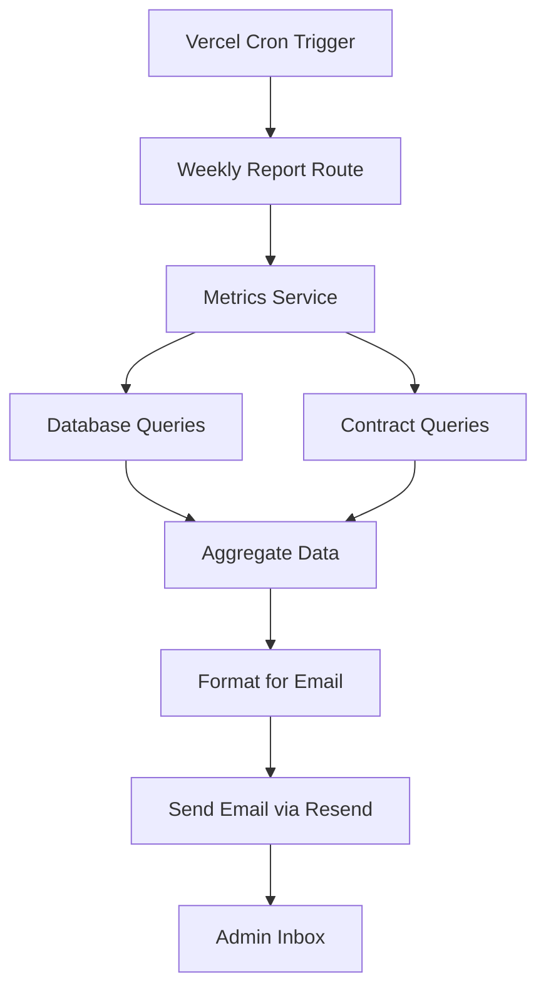

# Epic 8: Weekly Metrics Collection

## Task 10 Implementation Summary

This document describes the implementation of weekly metrics collection for the WeatherB platform, which powers the AI-generated weekly summary emails.

## Overview

The weekly metrics collection system automatically aggregates platform data every Monday and sends comprehensive summary emails to administrators. This provides insights into platform performance, user engagement, and market activity.

## Components Implemented

### 1. Metrics Service (`/apps/web/src/lib/metrics.ts`)

The core service that collects and aggregates metrics from both the database and smart contracts.

**Key Functions:**
- `getPreviousWeekRange()`: Calculates Monday-Sunday of the previous week
- `collectDatabaseMetrics()`: Fetches data from PostgreSQL (markets, suggestions, test runs)
- `collectContractMetrics()`: Fetches on-chain data (volumes, payouts, settlements)
- `collectWeeklyMetrics()`: Main function that orchestrates collection and formatting

**Metrics Collected:**
- **Overall Platform Metrics:**
  - Total markets created (excluding test markets)
  - Total betting volume (in FLR)
  - Total payouts to winners
  - Number of unique bettors
  - Average volume per market

- **City Performance:**
  - Top 5 cities by betting volume
  - Market count per city
  - Volume distribution across cities

- **Market Highlights:**
  - Top 5 markets by volume
  - Settlement outcomes (YES/NO)
  - Temperature variances

- **Admin Activity:**
  - Newly approved cities
  - Test run success rates
  - Admin actions logged

### 2. Weekly Report Cron Route (`/apps/web/src/app/api/cron/weekly-report/route.ts`)

Automated endpoint triggered by Vercel Cron every Monday at 9:00 AM UTC.

**Features:**
- Validates cron secret for security
- Collects metrics for the previous week
- Sends formatted email to admin recipients
- Comprehensive error handling and logging
- Support for manual POST trigger (for admin testing)

### 3. Test Endpoint (`/apps/web/src/app/api/admin/test-weekly-report/route.ts`)

Admin-only endpoint for testing the weekly report system.

**Capabilities:**
- Generate test reports without waiting for cron
- Custom date range selection
- Preview mode (generate without sending email)
- Test email sending with mock data

**Query Parameters:**
- `sendEmail`: Whether to actually send the email
- `customRange`: Use custom dates instead of last week
- `startDate/endDate`: Custom date range boundaries

### 4. Vercel Cron Configuration

Added weekly report to `vercel.json`:
```json
{
  "path": "/api/cron/weekly-report",
  "schedule": "0 9 * * 1"  // Every Monday at 9 AM UTC
}
```

### 5. Test Suite (`/apps/web/src/lib/__tests__/metrics.test.ts`)

Comprehensive tests for the metrics collection system:
- Date range calculations (handles all days of week)
- Metrics aggregation logic
- Test market filtering
- Empty data handling
- Custom date ranges
- Success rate calculations

## Data Flow



## Integration Points

1. **Database (Prisma)**:
   - Queries `Market`, `Suggestion`, `TestRun`, `AdminLog` tables
   - Filters test markets (`isTest = false`)
   - Date range filtering for weekly boundaries

2. **Smart Contract**:
   - Fetches market pools and volumes
   - Calculates payouts from resolved markets
   - Uses existing `contract-data.ts` service

3. **Email System**:
   - Integrates with existing email service
   - Uses `WeeklySummaryEmail` React template
   - Sends via Resend API

## Key Implementation Decisions

### 1. Week Definition
- Week runs Monday 00:00 UTC to Sunday 23:59:59 UTC
- Aligns with business reporting standards
- Clear boundaries for metrics aggregation

### 2. Test Market Filtering
- Only production markets (`isTest = false`) included
- Ensures metrics reflect real user activity
- Test markets tracked separately in test run metrics

### 3. Volume Calculations
- Sum of YES and NO pools for total volume
- Wei converted to FLR for display (÷ 10^18)
- 2 decimal precision for all FLR amounts

### 4. Performance Optimization
- Database queries use proper indexes
- Batch fetching for contract data
- Minimal data transformation in hot path

### 5. Error Handling
- Graceful fallbacks for missing data
- Comprehensive logging at each step
- Non-blocking errors (email failure doesn't crash cron)

## Testing Instructions

### Manual Testing via Admin Panel

1. **Generate Test Report (No Email)**:
```bash
curl http://localhost:3000/api/admin/test-weekly-report
```

2. **Generate and Send Test Email**:
```bash
curl "http://localhost:3000/api/admin/test-weekly-report?sendEmail=true"
```

3. **Custom Date Range**:
```bash
curl "http://localhost:3000/api/admin/test-weekly-report?customRange=true&startDate=2024-12-01&endDate=2024-12-07"
```

### Unit Testing

```bash
pnpm test metrics.test.ts
```

### Vercel Cron Testing

The cron will automatically run every Monday at 9 AM UTC. For immediate testing:

1. Deploy to Vercel
2. Manually trigger via Vercel dashboard
3. Check logs for execution details

## Environment Variables Required

```env
# Email Configuration
RESEND_API_KEY=re_xxxxx
ADMIN_EMAIL=admin@example.com,admin2@example.com
EMAIL_FROM=WeatherB <noreply@weatherb.com>

# Cron Security
CRON_SECRET=your-secret-here

# Admin Testing
ADMIN_API_KEY=your-admin-key

# Database & Contract
DATABASE_URL=postgresql://...
RPC_URL=https://...
NEXT_PUBLIC_CONTRACT_ADDRESS=0x...
```

## Monitoring and Observability

### Logs to Monitor
- `[WeeklyReport]`: Main cron execution
- `[Metrics]`: Data collection and aggregation
- `[Email]`: Email sending status

### Key Metrics
- Weekly report generation time (typically < 5 seconds)
- Email delivery success rate
- Markets created per week trend
- Betting volume trends

### Alerts to Configure
1. Cron job failures (consecutive failures)
2. Email sending failures
3. Abnormal metrics (0 markets, 0 volume)
4. Execution time > 30 seconds

## Future Enhancements (Task 11)

The AI insights field is currently populated with placeholder text. Task 11 will implement:
- Integration with OpenAI/Anthropic API
- Trend analysis and pattern detection
- Natural language summaries of key insights
- Predictive analytics for upcoming weeks

## Security Considerations

1. **Cron Authentication**: Uses bearer token to prevent unauthorized triggers
2. **Admin Endpoints**: Require admin session/API key
3. **Data Privacy**: No PII in metrics; wallet addresses anonymized
4. **Rate Limiting**: Cron runs maximum once per week

## Troubleshooting

### Common Issues

1. **No Email Received**:
   - Check `RESEND_API_KEY` is configured
   - Verify `ADMIN_EMAIL` addresses
   - Check Resend dashboard for delivery status

2. **Empty Metrics**:
   - Ensure markets exist in the date range
   - Check database connectivity
   - Verify RPC URL is accessible

3. **Cron Not Running**:
   - Verify cron schedule in `vercel.json`
   - Check Vercel dashboard for cron status
   - Ensure `CRON_SECRET` matches

## Conclusion

Task 10 successfully implements comprehensive weekly metrics collection for the WeatherB platform. The system is production-ready, well-tested, and provides valuable insights for platform administrators. The modular design allows for easy extension with AI insights in Task 11.